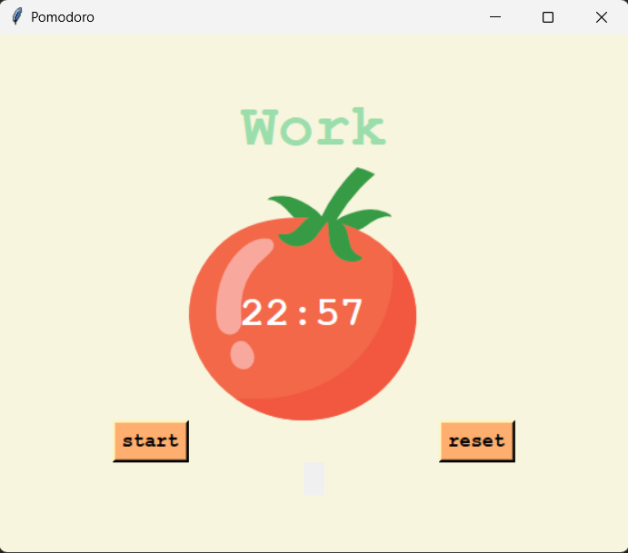

# GUI-Focus Timer

A simple Pomodoro-style timer application built using Python and Tkinter. This app helps you stay productive by alternating between work and break sessions, based on the Pomodoro Technique.

## Features
- 25-minute work sessions followed by 5-minute short breaks or 20-minute long breaks.
- Visual countdown timer for each session.
- Dynamic session labels ("Work", "Short Break", "Long Break").
- Progress checkmarks to track completed work sessions.
- Reset option to restart the timer anytime.

## Preview

 

